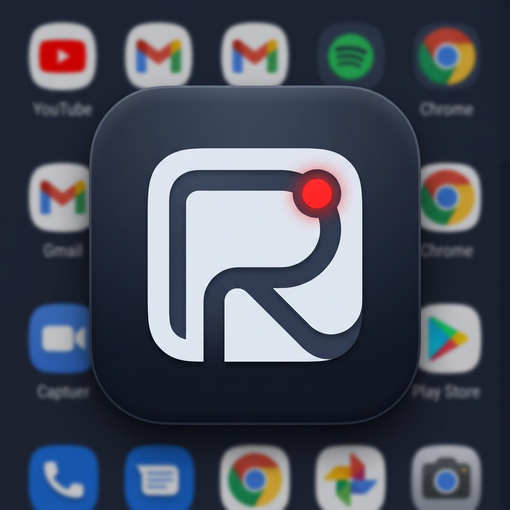
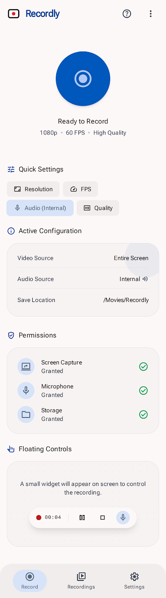

#  Recordly

[](https://github.com/giftussajeev/Recordly/releases/latest)
[](https://developer.android.com)
[](LICENSE)

Recordly is a native, lightweight, and privacy-focused screen recorder for Android. Built with Jetpack Compose, Material 3, and Kotlin. 

It does not contain ads, trackers, or analytics. It works fully offline with no internet required.

---

<p align="center">
  <a href="https://github.com/giftussajeev/Recordly/releases/latest">
    
  </a>
</p>

---

## Screenshot

<p align="center">
  
</p>

## Features

* **High-Resolution Recording**: Support for screen capture up to 1440p (QHD) matching device orientation and aspect ratio.
* **Audio Sources**: Captures microphone audio or system audio natively on supported Android versions.
* **Optimized Encoding**: Intelligently configures encoding bitrates based on your selected resolution, frame rate, and quality presets (Low, Balanced, High, Max).
* **Refresh Rate Matching**: Lock recordings to your screen's refresh rate for up to 120 FPS capture.
* **Smart Floating Control**: Draggable overlay bubble with quick stop and pause options that automatically collapses into a subtle timer dot after 4 seconds of inactivity.
* **Seamless Theming**: Smooth animated theme transitions supporting System, Light, Dark, and true black AMOLED modes.
* **Local Library Manager**: Gallery view with local search, file renaming, multi-select, sharing, and batch deletion.
* **Custom Storage**: Saves directly to your Movies folder by default, with support for custom directory selection via Storage Access Framework (SAF).

## Compatibility

| Android Version | API Level | Storage Model | Internal Audio | Theme Engine |
|:---|:---:|:---:|:---:|:---:|
| **Android 8.0 - 9.0** | 26 - 28 | Legacy Storage | Supported via Mic fallback | Material 3 (Static) |
| **Android 10 - 11** | 29 - 30 | Scoped Storage | Native API Supported | Material 3 (Static) |
| **Android 12+** | 31+ | Scoped Storage | Native API Supported | Material You (Dynamic) |

## Building from source

Prerequisites: JDK 17, Android SDK (API 35 target).

```bash
# Windows
.\gradlew.bat :app:assembleDebug

# macOS / Linux
chmod +x gradlew && ./gradlew :app:assembleDebug
```

The compiled APK will be located under `app/build/outputs/apk/debug/app-debug.apk`.

## Credits

* **Giftus Sajeev** (Lead Developer)
* **Sanjith KS** (UAT Tester)
* **AIs Used**: GPT-5.5 Extended, Gemini 3.1 Pro High, Gemini 3.5 Flash High, Claude Opus 4.7, and Google Stitch v3.

## License

Recordly is licensed under the Apache License 2.0. See [LICENSE](LICENSE) for details.
