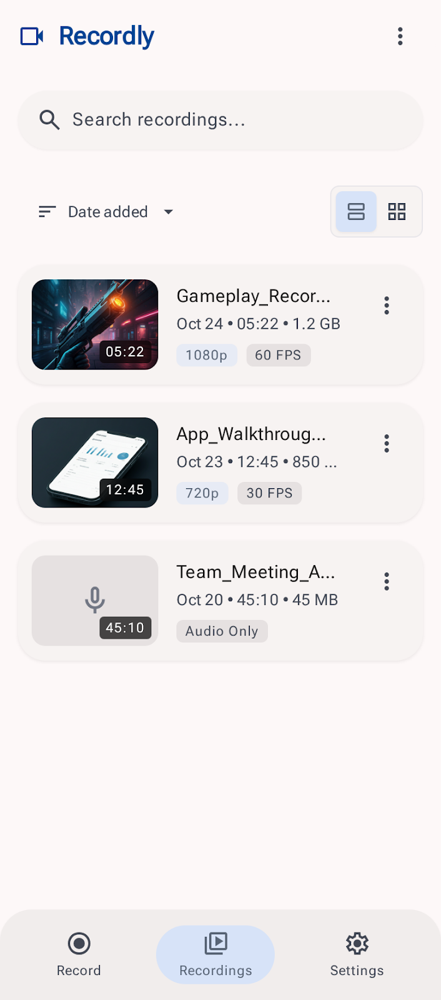

#  Recordly

[](https://github.com/giftussajeev/Recordly/releases/latest)
[](https://developer.android.com)
[](LICENSE)

Recordly is a native, lightweight, and privacy-focused screen recorder for Android. Built with Jetpack Compose, Material 3, and Kotlin. 

It does not contain ads, trackers, or analytics. It works fully offline with no internet permission required.

---

<p align="center">
  <a href="https://github.com/giftussajeev/Recordly/releases/latest">
    
  </a>
</p>

---

## Screenshots

<p align="center">
  
  &nbsp;&nbsp;&nbsp;&nbsp;
  
</p>

## Features

* **High-Performance Screen Capture**: Records up to 1440p (QHD) matching the native orientation and aspect ratio.
* **Match Display Refresh Rate**: Optionally record at your screen's native refresh rate (e.g. 90Hz, 120Hz).
* **Flexible Audio Input**: Choose between high-fidelity microphone recording or native internal audio capture (Android 10+).
* **Smart Quality Presets**: Select from Low, Balanced, High, or Max quality presets (automatically configures bitrates).
* **Auto-Collapse Overlay**: A draggable floating overlay for quick controls that collapses into a tiny timer dot after 4 seconds of inactivity.
* **Telegram-Style Theme Switching**: Changing themes (Light, Dark, System, AMOLED) triggers a premium circular reveal animation.
* **In-App Library Manager**: Built-in player and organizer with search, renaming, multi-select, and batch share/delete.
* **Custom Save Location**: Saves to `Movies/Recordly` by default, or you can pick any custom directory via SAF.

## Compatibility

| OS Version | API | Scoped Storage | Internal Audio | Theme Style |
|:---|:---:|:---:|:---:|:---:|
| **Android 8.0 - 9.0** | 26 - 28 | Legacy | ❌ | Material 3 (Static) |
| **Android 10 - 11** | 29 - 30 | Scoped | ✅ | Material 3 (Static) |
| **Android 12+** | 31+ | Scoped | ✅ | Material You (Dynamic) |

## Building from source

Prerequisites: JDK 17, Android SDK (API 35 target).

```bash
# Windows
.\gradlew.bat :app:assembleDebug

# macOS / Linux
chmod +x gradlew && ./gradlew :app:assembleDebug
```

The compiled APK will be located under `app/build/outputs/apk/debug/app-debug.apk`.

## Contributors

* **Giftus Sajeev**
* **Sanjith KS**

## License

Recordly is licensed under the Apache License 2.0. See [LICENSE](LICENSE) for details.
