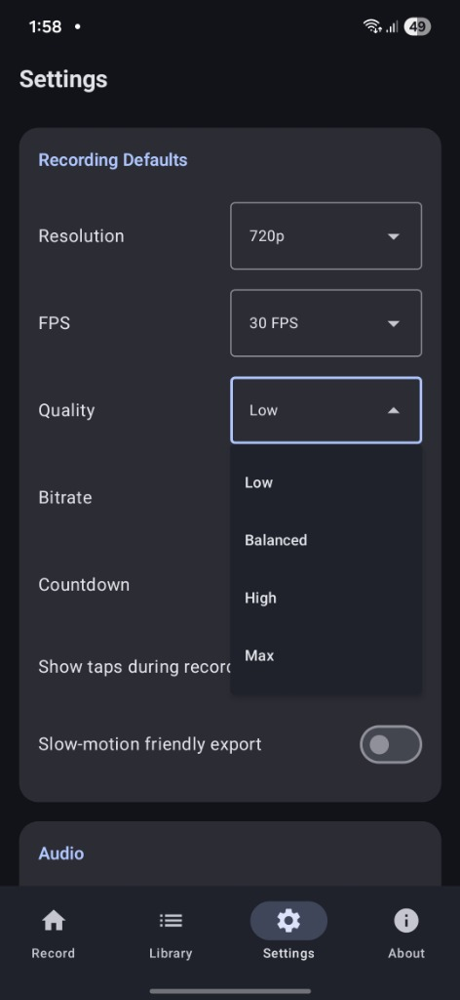
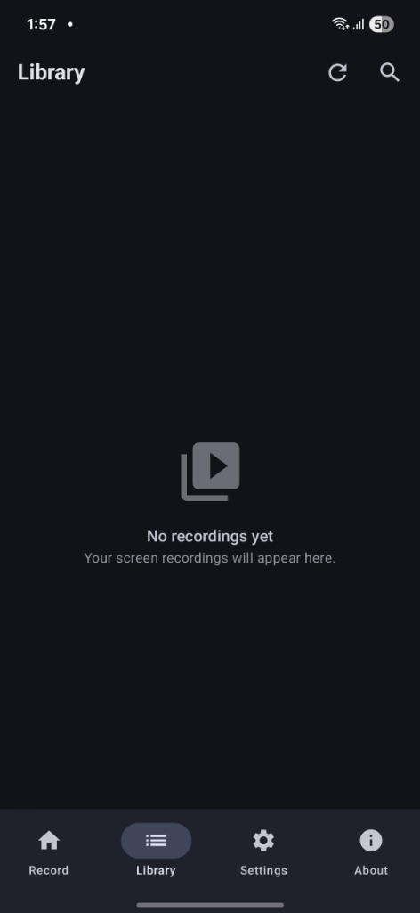
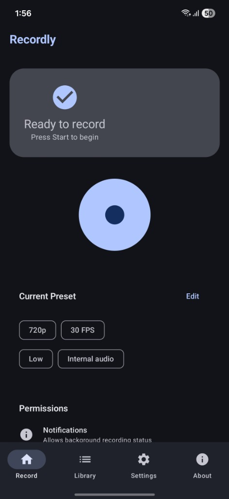
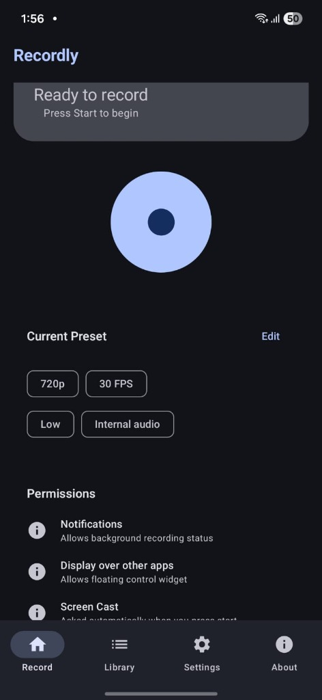

# Recordly

A clean, lightweight screen recorder for Android. Built with Kotlin, Jetpack Compose, and Material 3.

No ads. No analytics. No internet required. Everything stays on your device.

[](https://github.com/giftussajeev/Recordly/releases/latest)

> **Note:** Recordly is under active development. The current release is a testing build — expect rough edges. If something breaks, please open an issue.

## Screenshots

| Record | Library | Settings |
|--------|---------|----------|
|  |  |  |

| Settings Options | About |
|-----------------|-------|
|  |  |

## What it does

- Records your screen as MP4 video
- Configurable resolution (720p / 1080p / 1440p / Native), FPS, quality, and bitrate
- Microphone audio capture (internal audio is a work in progress)
- Floating overlay controls to stop/pause without switching apps
- Saves recordings to `Movies/Recordly`
- Built-in library to browse, play, share, and delete recordings
- Supports Android 8.0 (Oreo) and up

## What works right now (v1.3)

- Screen recording with configurable settings
- Settings persist between sessions (DataStore)
- Theme switching: System / Light / Dark / AMOLED
- Dynamic color (Material You) on Android 12+
- Library shows real recordings from device storage with search
- Permission handling before recording starts
- Floating overlay and notification controls
- Quick-edit chips on home screen with modern bottom sheet selectors

## What doesn't work yet

- Internal audio capture (Android limitation — requires AudioPlaybackCapture API)
- Custom resolution input
- Video trimming / editing
- Save location picker
- Quick settings tile

## Android Support

- **Minimum:** Android 8.0 (API 26)
- **Target:** Android 15 (API 35)
- **Internal audio:** Requires Android 10+ (not yet implemented)
- **Dynamic color:** Requires Android 12+

## Permissions

- **Screen Capture:** Records your screen (asked each time you start recording)
- **Microphone:** Records audio from your mic (optional)
- **Overlay:** Shows floating stop/pause controls
- **Notifications:** Shows recording status in notification bar
- **Storage:** Saves and reads your recordings

All processing is local. Nothing is uploaded anywhere.

## Build from source

```bash
# Requires JDK 17+
# Use Android Studio's bundled JDK if needed
./gradlew :app:assembleDebug
```

Install to a connected device:
```bash
adb install -r app/build/outputs/apk/debug/app-debug.apk
```

## Credits

Vibecoded with love by Giftus Sajeev and Sanjith KS.

Made with GPT-5.5 Extended, Gemini 3.1 Pro High, Claude Opus 4.7, and Google Stitch v3.

## License

Apache License 2.0. See [LICENSE](LICENSE) for details.
